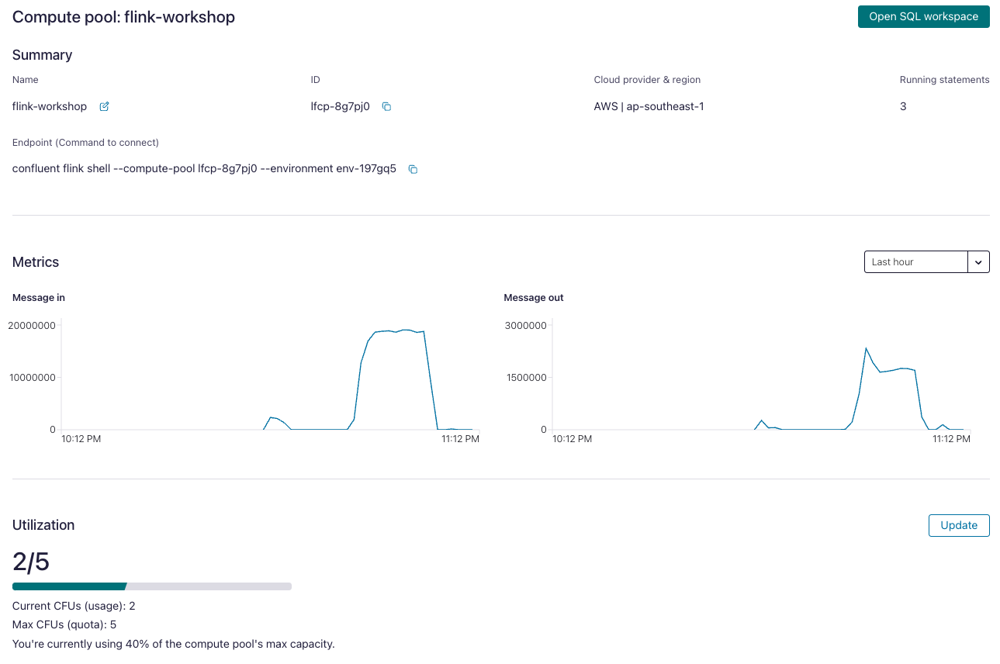
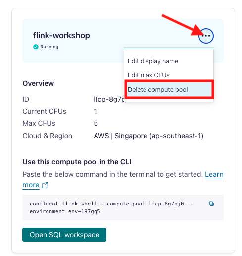

<div align="center" padding=25px>
    
</div>

# <div align="center">Confluent x AWS Data Streaming LIVE Lab</div>
## <div align="center">Lab Guide</div>
<br>

## **Agenda**
1. [Log into Confluent Cloud](#step-1)
2. [Create an Environment and Cluster](#step-2)
3. [Create Flink Compute Pool](#step-3)
4. [Create Topics and walk through Confluent Cloud Dashboard](#step-4)
5. [Create an API Key Pair](#step-5)
6. [Create Datagen Connectors for Customers, Products and Orders](#step-6)
7. [Flink Basics](#step-7)
8. [Flink Aggregations](#step-8)
9. [Flink Windowing Functions](#step-9)
10. [Flink Tables - Primary Key](#step-10)
11. [Flink Joins](#step-11)
12. [Customer Loyalty Level Calculation](#step-12)
13. [Create Promotional Campaigns](#step-13)
14. [Connect Flink with Bedrock Model](#step-14)
15. [Flink Monitoring](#step-15)
16. [Clean Up Resources](#step-16)
17. [Confluent Resources and Further Testing](#step-17)

***

## **전제 조건**
<br>
1. Confluent Cloud 계정을 만듭니다.
 - Confluent Cloud 계정에 가입하십시오 [여기] (https://www.confluent.io/confluent-cloud/tryfree/).
 - 가입하고 로그인 한 후 오른쪽 상단 코너의 메뉴 아이콘을 클릭하고 "Billing & payment"을 클릭 한 다음 "Payment details & contacts”"에 지불 세부 정보를 입력하십시오. Billing UI의 스크린 샷은 다음과 같습니다.

> **Note:** 이 워크숍 동안 비용이 발생할 수있는 리소스를 만들게됩니다. Confluent Cloud 계정에 가입하면 Confluent Cloud에서 사용할 수있는 무료 크레딧을 얻게됩니다. 이는 워크숍 동안 생성 된 자원 비용을 포함합니다. 세부 사항에 대한 자세한 내용은 확인할 수 있습니다 [here](https://www.confluent.io/confluent-cloud/tryfree/).

<div align="center" padding=25px>
    
</div>

***

## **목적**

<br>

"합류 클라우드에서 Apache Flink를 사용하여 실시간 데이터 변환 및 스트림 처리 활성화"에 오신 것을 환영합니다! 이 워크숍에서는 합류 클라우드에서 Apache Flink를 사용하여 스트림 처리 애플리케이션을 구축하는 방법을 배우고 Apache Flink Unlocks (스트리밍 ETL, 데이터 검색 및 강화, 이상 탐지 등 사용)에 대해 배우게됩니다.

 이 워크숍에서는 Apache Flink를 활용하여 지속적인 변환을 수행하고, 구체화 된 뷰를 만들고, 구체화 된 뷰에 대한 조회를 제공하는 방법을 배웠을 것입니다..

<div align="center" padding=25px>
    
</div>

***


## <a name="step-1"></a>Log into Confluent Cloud

1. [Confluent Cloud](https://confluent.cloud) 에 로그인하기 위해 이메일과 비밀번호를 입력하십시오.

<div align="center" padding=25px>
    
</div>

2. 처음으로 로그인하는 경우 클러스터의 기본 기능을 돌아볼 수 있는 셀프 가이드 마법사가 표시됩니다. 이 워크숍에서 이러한 단계를 진행할 때 이를 최소화하십시오.

***

## <a name="step-2"></a>Create an Environment and Cluster

환경에는 클러스터, Apache Flink, 커넥터, KSQLDB 및 스키마 레지스트리등 여러가지 배포된 구성 요소가 포함되어 있습니다. 회사의 요구 사항에 따라 다양한 환경을 만들 수 있습니다. 예를 들어 환경을 사용하여 개발/테스트, 스테이징 및 운영 클러스터를 분리할 수 ​​있습니다.

1.**New Environment**를 클릭하십시오. **Environment Name**을 지정하고 **Create**를 클릭하십시오. 

>**Note:** 계정 생성 시 계정에는 기본적으로 **default** 환경이 준비되어 있습니다. 추가 환경을 만들고 싶지 않은 경우이 워크숍의 목적으로 이 **default** 환경을 사용할 수 있습니다.

<div align="center" padding=25px>
    
</div>

2.이제 Environment를 만들었으므로 **Create Cluster**를 클릭하십시오.

> **Note:** Confluent Cloud 클러스터는 basic, standard, Enterprise, dedicated 4 가지 유형으로 제공됩니다. basic은 개발 사용 사례를 위한 것이므로 워크숍에 사용합니다. basic 클러스터는 단일 영역 가용성만 지원합니다. standard, enterprise 및 dedicated 클러스터는 실제 운영환경을 위한 것이며 멀티 존 배포를 지원합니다. 다양한 유형의 클러스터와 관련 기능 및 한계에 대해 더 많이 배우고 싶다면 이 [문서](https://docs.confluent.io/current/cloud/clusters/cluster-types.html)를 참조하십시오..

3. **Basic** 클러스터 유형을 선택했습니다.

<div align="center" padding=25px>
    
</div>

4. **Begin Configuration** 선택.
5. 선호하는 클라우드 제공 업체 (AWS, GCP 또는 Azure), 지역 및 가용성 영역을 선택하십시오.
6. **Cluster Name**을 지정하십시오. 이 워크샵의 목적을 위해 어떤 이름으로도 작동합니다.

<div align="center" padding=25px>
    
</div>

7. 관련 **configuration & cost**, **Usage limits** 및 **Uptime SLA** 정보를 확인합니다.
8. **Launch Cluster** 클릭하십시오.

***

## <a name="step-3"></a>Create Flink Compute Pool

1. 탐색 메뉴의 **Flink**에서 **Create Compute Pool** 를 클릭하십시오.

<div align="center" padding=25px>
    
</div>

2. **Region** 을 선택하고 **Continue** 를 클릭하십시오.
<div align="center" padding=25px>
    
</div>

3. 풀 이름을 지정하고 용량(CFU)를 **5**로 설정하십시오. **Finish**를 클릭하십시오.

<div align="center" padding=25px>
    
</div>

> **Note:** 컴퓨팅 풀의 용량은 CFU에서 측정됩니다. 컴퓨팅 풀은 풀을 사용하는 명령문에 필요한 리소스에 따라 자동으로 확장 및 축소됩니다. 실행 명령문이 없는 컴퓨팅 풀은 0으로 줄어 듭니다. 컴퓨팅 풀의 최대 크기는 생성 중에 선택하여 구성되며 언제든지 변경이 가능합니다. 

4. Flink Compute Pool은 곧 준비됩니다. 풀을 사용할 준비가 되었으면, **Open SQL workspace**을 클릭하십시오.

<div align="center" padding=25px>
    
</div>

5. **settings button** 클릭하여 작업공간 이름을 변경하십시오. 워크스페이스 이름을 변경하고 **Save changes** 클릭하십시오

<div align="center" padding=25px>
    
</div>

6. 기본 카탈로그를 환경 이름으로 설정하십시오.

<div align="center" padding=25px>
    
</div>

7. 기본 데이터베이스를 클러스터 이름으로 설정하십시오.

<div align="center" padding=25px>
    
</div>

***

## <a name="step-4"></a>Creates Topic and Walk Through Cloud Dashboard

1. 탐색 메뉴에서 **Cluster Overview**. 를 클릭하십시오. 

> **Note:** 이 섹션에서는 처리량 및 스토리지와 같은 클러스터 메트릭을 보여줍니다. 이 페이지는 또한 주제, 파티션, 커넥터 및 KSQLDB 응용 프로그램의 수를 보여줍니다. 아래는 Confluent Cloud를 통해 데이터가 흐르는 메트릭 대시 보드의 예입니다.

<div align="center" padding=25px>
    
</div>

2. **Cluster Settings** 클릭하십시오. 이곳에서 **클러스터 ID**, **부트 스트랩 서버**, **클라우드 세부 사항**, **클러스터 유형**, 및 **용량 제한**을 찾을 수 있습니다.
3. 동일한 내비게이션 메뉴에서, **Topics** 선택하고 **Create Topic**을 클릭하십시오.. 
4. 토픽이름으로 **shoe_products** 입력하고, 파티션 수로 **3**을 입력하고, **Create with defaults**을 클릭하십시오. 

<div align="center" padding=25px>
    
</div>

5. 이전 단계를 반복하고 **shoe_customers** 과 **3** 개의 파티션으로 두번째 토픽을 만듭니다. 
   
6. 이전 단계를 반복하고 **shoe_orders** 과 **3** 개의 파티션으로 세번째 토픽을 만듭니다. 

> **Note:** Topic에는 많은 구성 가능한 매개 변수가 있습니다. Confluent Cloud 에 대한 구성의 전체 목록을 [여기](https://docs.confluent.io/cloud/current/using/broker-config.html)에서 찾을 수 있습니다. 기본 구성을 보는 데 관심이 있으시면 오른쪽의 Topic 요약에서 볼 수 있습니다.

7. Topic 생성 후 **Topic UI**를 사용하면 Production / Consumption 처리량 메트릭과 Topic의 구성 매개 변수를 모니터링 할 수 있습니다. Conflure Cloud에 메시지를 보내기 시작하면 해당 메시지 및 메시지 스키마를 볼 수 있습니다.

8. 아래는 **shoe_order** Topic을 보여주지만 메트릭을 보려면 이 Topic으로 데이터를 보내야 합니다.

<div align="center" padding=25px>
    
</div>

***

## <a name="step-5"></a>Create an API Key

1. 탐색 메뉴에서 **API Keys** 를 클릭하십시오.
2. 첫번째 API Key를 만들기 위해 **Create Key** 를 클릭하십시오. 기존에 API Key가 있다면 **+ Add Key** 로 다른 API Key를 생성할 수 있습니다.

<div align="center" padding=25px>
    
</div>

3. **Global Access** 를 선택하고 **Next** 클릭하십시오. 

4. API Key와 Secret은 어딘가에 복사하거나 저장하십시오. 나중에 워크샵에서 이것들이 필요할 것입니다. 이 대화창을 닫으면 Secret을 다시 볼 수 없습니다.

5. API Key를 생성하고 저장 한 후에는 Confluent Cloud UI의 **API Key** 메뉴에 이 API Key가 표시됩니다. API Key가 바로 채워지지 않으면 브라우저를 새로 고치십시오.

***

## <a name="step-6"></a>Create Datagen Connectors for Customers, Products and Orders

다음 단계는 Datagen 소스 커넥터를 사용하여 샘플 데이터를 생성하는 것입니다. 3 개의 Datagen 소스 커넥터를 생성합니다. 하나의 커넥터는 샘플 고객 데이터를 **shoe_customers** Topic으로 보냅니다. 다른 커넥터는 샘플 제품 데이터를 **shoe_products** Topic으로 보냅니다. 그리고 마지막 커넥터는 샘플 주문 데이터를 **shoe_orders** Topic으로 보냅니다.

1. 먼저, **shoe_customers**로 데이터를 보내는 커넥터를 만듭니다. Confluent Cloud UI에서 탐색 메뉴의 **Connector** 를 클릭하십시오. **Sample Data** 아이콘을 클릭하십시오.

<div align="center" padding=25px>
    
</div>

2. 다음 구성 세부 정보를 입력하십시오. 나머지 필드는 비워둘 수 있습니다.

<div align="center">

| setting                            | value                        |
|------------------------------------|------------------------------|
| name                               | DatagenSourceConnector_shoe_customers |
| api key                            | [*from step 5* ](#step-5)    |
| api secret                         | [*from step 5* ](#step-5)    |
| topic                              | shoe_customers               |
| output message format              | AVRO                         |
| quickstart                         | Shoe customers               |
| max interval between messages (ms) | 1000                         |
| tasks                              | 1                            |
</div>

<br>

<div align="center" padding=25px>
    
    
</div>

3. **Show advanced configurations** 을 클릭하여 필요한 항목을 입력하고 **Continue**를 클릭하십시오.

<div align="center" padding=25px>
    
</div>
   
4. 커넥터를 시작하기 전에 다음과 비슷한것을 볼 수 있습니다. 모든 것이 비슷해 보이면 **Launch**를 선택하십시오.

<div align="center" padding=25px>
    
</div>

5. 다음으로 **shoe_products** Topic으로 데이터를 보낼 두 번째 커넥터를 만듭니다. **Add Connector**를 클릭한 다음 **Sample Ddata** 아이콘을 다시 클릭하십시오

6. 다음 구성 세부 정보를 입력하십시오. 나머지 필드는 비워둘 수 있습니다.

<div align="center">

| setting                            | value                        |
|------------------------------------|------------------------------|
| name                               | DatagenSourceConnector_shoe_products |
| api key                            | [*from step 5* ](#step-5)    |
| api secret                         | [*from step 5* ](#step-5)    |
| topic                              | shoe_products                |
| output message format              | AVRO                         |
| quickstart                         | Shoes                        |
| max interval between messages (ms) | 1000                         |
| tasks                              | 1                            |
</div>

<br> 

7. 출력을 다시 검토 한 다음 **Launch**를 선택하십시오.

8. 다음으로 **shoe_orders**로 데이터를 보내는 두 번째 커넥터를 만듭니다. **Add Connector**를 클릭한 다음 **Sample Dadata** 아이콘을 다시 클릭하십시오.

9. 다음 구성 세부 정보를 입력하십시오. 나머지 필드는 비워 둘 수 있습니다.

<div align="center">

| setting                            | value                        |
|------------------------------------|------------------------------|
| name                               | DatagenSourceConnector_shoe_orders |
| api key                            | [*from step 5* ](#step-5)    |
| api secret                         | [*from step 5* ](#step-5)    |
| topic                              | shoe_orders                  |
| output message format              | AVRO                         |
| quickstart                         | Shoe orders                  |
| max interval between messages (ms) | 1000                         |
| tasks                              | 1                            |
</div>

<br> 

10. 출력을 다시 검토한 다음 **Launch**를 클릭하십시오.

> **Note:** 커넥터가 시작되는데 잠시 시간이 걸릴 수 있습니다. 상태를 확인하고 둘 다 준비가 되면 상태가 **Running**을 표시해야 합니다. <br> <div align="center"></div>

> **Note:** 커넥터가 실패하면 오류를 해결하는 몇 가지 방법이 있습니다.
 > * 커넥터 이름을 클릭하십시오. 이 페이지에는 재생 및 일시 중지 버튼이 표시됩니다. 재생 버튼을 클릭하십시오.
 > * 커넥터 이름을 클릭하고 **Settings**으로 이동하여 API Key와 Secret을 다시 입력하십시오. 
 > * 이 단계 중 어느 것도 작동하지 않으면 다른 Datagen 커넥터를 만들어 보십시오.


11. 실시간으로 Topic으로 흐르는 샘플 데이터를 볼 수 있습니다. **Topics** 탭으로 이동한 다음 **shoe_customers**를 클릭하십시오. 여기에서 Production 과 Consumption 처리량 지표를 볼 수 있습니다.

12. **Messages** 탭을 클릭하십시오.

* 이제 UI 내의 메시지를 볼 수 있어야 합니다. 아이콘을 클릭하여 특정 메시지를 볼 수 있습니다.

<div align="center">
    
</div> 

* 메시지 세부 사항은 다음과 같은 것 같습니다.

<div align="center">
    
</div>

***

## <a name="step-7"></a>Flink Basics
Kafka Topci과 스키마는 항상 Flink 클러스터와 동기화됩니다. Kafka에서 생성된 모든 Topic은 Flink의 테이블로 직접 볼 수 있으며 Flink에서 생성 된 모든 테이블은 Kafka에서 Topic으로 보입니다(Temporary Table을 사용할 수도 있습니다.). 효과적으로 Confluent Cloud 위에 Flink SQL 인터페이스를 제공합니다.

다음 매핑이 존재합니다.
| Kafka          | Flink     | 
| ------------   | --------- |
| Environment    | Catalog   | 
| Cluster        | Database  |
| Topic + Schema | Table     |

1. **Flink SQL** 기본 사항에 익숙해지기 바랍니다.
```sql
SHOW CATALOGS;
```

```
SHOW DATABASES;
```

```sql
SHOW TABLES;
```
<div align="center">
    
</div>

테이블 `shoe_products`가 어떻게 만들어 졌는지 확인해봅니다.

```sql
SHOW CREATE TABLE shoe_products;
```

<div align="center">
    
</div>

모든 DDL 문에 대한 자세한 내용은 [여기](https://docs.confluent.io/cloud/current/flink/reference/statements/overview.html)에서 확인 할 수 있습니다.

먼저 `shoe_products` 카탈로그에 대한 테이블 스키마를 확인하겠습니다. 이것은 Schema Registry의 주제 스키마와 동일해야합니다.
```sql
DESCRIBE shoe_products;
```

2. 테이블에 제품 기록이 있는지 확인해 봅시다.
```sql
SELECT * FROM shoe_products;
```

3. `shoe_customers`스키마가 있는지 확인하십시오.
```sql
DESCRIBE shoe_customers;
```

4. 이름이`b`로 시작하는 Texas의 고객을 확인하십시오.
```sql
SELECT * FROM shoe_customers
  WHERE `state` = 'Texas' AND `last_name` LIKE 'B%';
```

5. 한 고객에 대한 첫 10 개의 주문을 확인하십시오.
```sql
SELECT order_id,
       product_id,
       customer_id,
       $rowtime AS ingestion_time
  FROM shoe_orders
  WHERE customer_id = 'b523f7f3-0338-4f1f-a951-a387beeb8b6a'
  LIMIT 10;
```

6. 한 고객의 모든 주문에 대한 메시지 타임 스탬프 찾을수 있습니다.
```sql
SELECT order_id,
       customer_id,
       $rowtime AS ingestion_time
FROM shoe_orders
WHERE customer_id = 'b523f7f3-0338-4f1f-a951-a387beeb8b6a';
```

<div align="center">
    
</div>

***

## <a name="step-8"></a>Flink Aggregations
1. 고객수를 찾으십시오.
```sql
SELECT COUNT(id) AS num_records
FROM shoe_customers;
```

2. 고유한 고객수를 찾으십시오.
```sql
SELECT COUNT(DISTINCT id) AS num_customers
FROM shoe_customers;
```

3. 각 신발 브랜드에 대해 신발 모델 수, 평균 등급 및 최대 모델 가격을 찾으십시오.
```sql
SELECT brand as brand_name, 
       COUNT(DISTINCT name) as models_by_brand,
       ROUND(AVG(rating),2) as avg_rating,
       MAX(sale_price) as max_price
FROM shoe_products
GROUP BY brand;
```

<div align="center">
    
</div>

> **Note:** Flink Aggregation Functions에 대한 자세한 내용은 [다음](https://docs.confluent.io/cloud/current/flink/reference/functions/aggregate-functions.html)을 확인하시기 바랍니다.

***

## <a name="step-9"></a>Flink Windowing Functions
Windows은 무한 스트림 처리의 중심입니다. Windows는 스트림을 유한 크기의 "버킷"으로 나누어 계산을 적용할 수 있습니다. 다음은 Confluent Cloud에서 Apache Flink Windowing을 수행하는 방법과 Windows 기능의 혜택을 얻을 수 있는 방법에 중점을 둡니다.

Flink는 다음을 포함하여 테이블의 요소를 Windows로 나누기 위해 여러 Windows 테이블 값 함수(TVF)를 제공합니다.

a. [Tumble Windows](https://docs.confluent.io/cloud/current/flink/reference/queries/window-tvf.html#flink-sql-window-tvfs-tumble)
<br> 
b. [Hop Windows](https://docs.confluent.io/cloud/current/flink/reference/queries/window-tvf.html#flink-sql-window-tvfs-hop)
<br> 
c. [Cumulate Windows](https://docs.confluent.io/cloud/current/flink/reference/queries/window-tvf.html#flink-sql-window-tvfs-cumulate)
<br> 

1. 1분 간격에 대한 주문 금액을 찾으십시오. (Tumbling Window Aggregation)
```sql
SELECT window_end,
       COUNT(DISTINCT order_id) AS num_orders
FROM TABLE(
  TUMBLE(TABLE shoe_orders, DESCRIPTOR(`$rowtime`), INTERVAL '1' MINUTES))
GROUP BY window_end;
```

<div align="center">
    
</div>

2. 10분 간격으로 5분씩 진행되는 주문 금액을 찾으십시오. (hopping window aggregation).
```sql
SELECT window_start,
       window_end,
       COUNT(DISTINCT order_id) AS num_orders
FROM TABLE(
  HOP(TABLE shoe_orders, DESCRIPTOR(`$rowtime`), INTERVAL '5' MINUTES, INTERVAL '10' MINUTES))
GROUP BY window_start, window_end;
```

> **Note:** Flink Window Aggregation에 대한 자세한 정보는 [다음](https://docs.confluent.io/cloud/current/flink/reference/queries/window-tvf.html)을 확인하기 바랍니다.

***

## <a name="step-10"></a>Flink Tables - Primary Key
기본 키 제약 조건은 Flink SQL이 테이블 또는 뷰의 열 또는 열 세트가 고유하고 NULL을 포함하지 않음을 지정하여 최적화하는 힌트입니다. 기본 키의 열을 무효화할 수는 없습니다. 기본 키는 테이블에서 행을 고유하게 식별합니다.
자세한 내용은 [다음](https://docs.confluent.io/cloud/current/flink/reference/statements/create-table.html#primary-key-constraint)을 확인하십시오 [link.]

1. 고유한 고객만 저장할 새 테이블을 만듭니다.
```sql
CREATE TABLE shoe_customers_keyed (
  customer_id STRING,
  first_name STRING,
  last_name STRING,
  email STRING,
  PRIMARY KEY (customer_id) NOT ENFORCED
) DISTRIBUTED BY (customer_id) INTO 1 BUCKETS;
```

2. 새 테이블`shoe_customers_keyed`를 `shoe_customers`와 비교하십시오.
```sql
SHOW CREATE TABLE shoe_customers;
```
```sql
SHOW CREATE TABLE shoe_customers_keyed;
```

<div align="center">
    
</div>

기본 키 옵션이 있는 테이블을 만들면 Changelog-mode를 Upsert로 변경합니다. 이는 동일한 기본 키가 있는 모든 행이 관련되어 있고 함께 분할되어야 함을 의미합니다.
자세한 내용은 [다음](https://docs.confluent.io/cloud/current/flink/reference/statements/create-table.html#changelog-mode)을 확인하십시오.

3. 원래 테이블에서 새 테이블로 고객 데이터를 복사하기 위해 새 플링크 작업을 작성하십시오.
```sql
INSERT INTO shoe_customers_keyed
  SELECT id,
         first_name,
         last_name,
         email
    FROM shoe_customers;
```

4.`shoe_customers_keyed`에서 고객수를 보여줍니다.
```sql
SELECT COUNT(*) as number_of_customers
FROM shoe_customers_keyed;
```

5.키 테이블 `SHOE_CUSTOMERS_KEYED`에서 특정 고객을 찾아보십시오.
```sql
SELECT * 
FROM shoe_customers_keyed  
WHERE customer_id = 'b523f7f3-0338-4f1f-a951-a387beeb8b6a';
```

6. 키가 없는 테이블에서 특정 고객 변경 기록을 찾으십시오 (`SHOE_CUSTOMERS`).
```sql
SELECT *
FROM shoe_customers
WHERE id = 'b523f7f3-0338-4f1f-a951-a387beeb8b6a';
```

7. 제품 카탈로그 테이블에는 각 항목마다 고유한 행이 필요합니다.
각 제품의 최신 정보를 얻으려면 새 테이블을 만듭니다. 분석 목적으로 제품의 최신 가격을 알아야 할 때 유용하거나 다른 테이블과 합쳐지는 동안 최신 제품 정보를 채워야 합니다. CTAS(Create Table As Select)를 사용하여 새 테이블을 만들것 입니다.
```sql
CREATE TABLE shoe_products_keyed(
  PRIMARY KEY (product_id) NOT ENFORCED
) DISTRIBUTED BY (product_id) INTO 1 BUCKETS
WITH (
    'changelog.mode' = 'upsert'
)
AS SELECT
         id as product_id,
         brand,
         `name`,
         sale_price,
         rating 
    FROM shoe_products;
```

8. CTAS는 테이블 작성 및 하나의 SQL 구문에 삽입하여 단순화됩니다. 일부 제품에 대해 단일 레코드만 반환하는지 확인하십시오.
```sql
SELECT * 
FROM shoe_products_keyed  
WHERE product_id = '0fd15be0-8b95-4f19-b90b-53aabf4c49df';
```

***

## <a name="step-11"></a>Flink Joins
Flink는 동적 테이블을 통해 복잡하고 유연한 조인 작업을 지원합니다. 쿼리가 요구할 수 있는 다양한 의미를 설명하기 위해 여러 가지 유형의 조인이 있습니다.
기본적으로 조인 순서는 최적화되지 않습니다. 테이블은 FROM절에 지정된 순서로 결합됩니다.
업데이트 빈도가 가장 낮은 테이블과 마지막 업데이트 빈도가 가장 높은 테이블을 나열하여 조인 쿼리의 성능을 조정할 수 있습니다. 크로스 조인 (Cartesian Product)을 생성하지 않는 순서로 테이블을 지정하여 지원되지 않고 쿼리가 실패하게 됩니다.
자세한 내용은 [다음](https://docs.confluent.io/cloud/current/flink/reference/queries/joins.html)을 확인을 확인하십시오.

1. 키가 없는 고객과 주문 기록을 조인하십시오 (Regular Join).
```sql
SELECT order_id,
       shoe_orders.`$rowtime` as ingestion_time,
       first_name,
       last_name
FROM shoe_orders
INNER JOIN shoe_customers 
ON shoe_orders.customer_id = shoe_customers.id
WHERE customer_id = 'b523f7f3-0338-4f1f-a951-a387beeb8b6a';
```

<div align="center">
    
</div>

> **Note:** 예상대로 키가 없는 레코드로 인해 중복된 항목이 있습니다.

2. 일정 시간 간격으로 키가 없는 고객 레코드와 주문을 조인하십시오 (Interal Join).
고객 정보의 마지막 업데이트 후 1 시간 간격으로 특정 고객의 주문을 찾으십시오.
```sql
SELECT order_id,
       shoe_orders.`$rowtime` as order_time,
       shoe_customers.`$rowtime` as customer_info_update_time,
       first_name,
       last_name
FROM shoe_orders
INNER JOIN shoe_customers
ON shoe_orders.customer_id = shoe_customers.id
WHERE customer_id = 'b523f7f3-0338-4f1f-a951-a387beeb8b6a'
      AND
      shoe_orders.`$rowtime`
        BETWEEN
         shoe_customers.`$rowtime`
         AND
         shoe_customers.`$rowtime` + INTERVAL '1' HOUR;
```

<div align="center">
    
</div>

3. 키가 있는 고객 레코드와 함께 주문을 조인하십시오 (Keyed 테이블과 정기적으로 조인).
```sql
SELECT order_id,
       shoe_orders.`$rowtime` as ingestion_time,
       first_name,
       last_name
FROM shoe_orders
INNER JOIN shoe_customers_keyed 
ON shoe_orders.customer_id = shoe_customers_keyed.customer_id
WHERE shoe_customers_keyed.customer_id = 'b523f7f3-0338-4f1f-a951-a387beeb8b6a';
```

<div align="center">
    
</div>

> **Note:** 예상대로 행의 수는 키가 없는 테이블 조인보다 적습니다. 중복 항목이 제거됩니다.

4. 주문이 생성된 시점(Key 테이블과의 임시 조인)에 Keyed 고객 레코드와 주문을 조인하십시오. 주문 생성 시 최신 고객 정보를 사용하여 특정 고객의 주문을 찾으십시오.
```sql
SELECT order_id,
       shoe_orders.`$rowtime` as order_time,
       shoe_customers_keyed.`$rowtime` as customer_info_update_time,
       first_name,
       last_name
FROM shoe_orders
INNER JOIN shoe_customers_keyed FOR SYSTEM_TIME AS OF shoe_orders.`$rowtime`
ON shoe_orders.customer_id = shoe_customers_keyed.customer_id
WHERE shoe_customers_keyed.customer_id = 'b523f7f3-0338-4f1f-a951-a387beeb8b6a';
```

<div align="center">
    
</div>

> **Note:** `Shoe_orders` 토픽에서 주문 레코드를 수집된 후 키가 지정된 고객 테이블이 생성된 경우 빈 결과 세트가 있을 수 있습니다.

> **Note:** Temporal Join 에 대한 자세한 내용은 [다음](https://docs.confluent.io/cloud/current/flink/reference/queries/joins.html#temporal-joins)을 확인하십시오.

5. 고객 및 제품 테이블로 주문 정보를 보강합니다. 보강된 주문 정보를 위한 새 테이블을 만듭니다.
```sql
CREATE TABLE shoe_orders_enriched_customer_product
DISTRIBUTED BY (order_id) INTO 1 BUCKETS
WITH (
    'changelog.mode' = 'retract'
)
AS SELECT
  so.order_id,
  sc.first_name,
  sc.last_name,
  sc.email,
  sp.brand,
  sp.`name`,
  sp.sale_price,
  sp.rating
FROM 
  shoe_orders so
  INNER JOIN shoe_customers_keyed sc 
    ON so.customer_id = sc.customer_id
  INNER JOIN shoe_products_keyed sp
    ON so.product_id = sp.product_id;
```

데이터가 성공적으로 결합되었는지 확인하십시오.
```sql
SELECT * FROM shoe_orders_enriched_customer_product;
```

<div align="center">
    
</div>


***

## <a name="step-12"></a>Customer Loyalty Level Calculation
1. 각 고객의 충성도 수준을 계산하십시오
```sql
SELECT
  email,
  SUM(sale_price) AS total,
  CASE
    WHEN SUM(sale_price) > 700000 THEN 'GOLD'
    WHEN SUM(sale_price) > 70000 THEN 'SILVER'
    WHEN SUM(sale_price) > 7000 THEN 'BRONZE'
    ELSE 'CLIMBING'
  END AS loyalty_level
FROM shoe_orders_enriched_customer_product
GROUP BY email;
```

<div align="center">
    
</div>


2. 고객의 충성도 수준을 저장하는 새 테이블을 만듭니다.
```sql
CREATE TABLE shoe_loyalty_levels(
  email STRING,
  total BIGINT,
  loyalty_level STRING,
  PRIMARY KEY (email) NOT ENFORCED
) DISTRIBUTED BY (email) INTO 1 BUCKETS ;
```
```sql
INSERT INTO shoe_loyalty_levels(
 email,
 total,
 loyalty_level)
SELECT
  email,
  SUM(sale_price) AS total,
  CASE
    WHEN SUM(sale_price) > 700000 THEN 'GOLD'
    WHEN SUM(sale_price) > 70000 THEN 'SILVER'
    WHEN SUM(sale_price) > 7000 THEN 'BRONZE'
    ELSE 'CLIMBING'
  END AS loyalty_level
FROM shoe_orders_enriched_customer_product
GROUP BY email;
```

3. 결과를 확인하십시오.
```sql
SELECT *
FROM shoe_loyalty_levels;
```

<div align="center">
    
</div>

***

## <a name="step-13"></a>Create Promotional Campaigns
보강된 주문 테이블을 기반으로 특별 프로모션을 만듭니다.
1. **`Jones-Stokes`** 신발을 **10 번**를 주문한 자격이 있는 고객을 찾으십시오.
```sql
SELECT
   email,
   COUNT(*) AS total,
   (COUNT(*) % 10) AS sequence,
   (COUNT(*) % 10) = 0 AS next_one_free
FROM shoe_orders_enriched_customer_product
WHERE brand = 'Jones-Stokes'
GROUP BY email;
```

2. **`Braun-Bruen`** 과 **`Will Inc`**을 **10번**이상 주문한 적격 고객을 찾으십시오.
```sql
SELECT
   email,
   COLLECT(brand) AS products,
   'bundle_offer' AS promotion_name
FROM shoe_orders_enriched_customer_product
WHERE brand IN ('Braun-Bruen', 'Will Inc')
GROUP BY email
HAVING COUNT(DISTINCT brand) = 2 AND COUNT(brand) > 10;
```

3. 프로모션 알림을 위한 테이블을 만듭니다.
```sql
CREATE TABLE shoe_promotions(
  email STRING,
  promotion_name STRING,
  PRIMARY KEY (email) NOT ENFORCED
) DISTRIBUTED BY (email) INTO 1 BUCKETS;
```

4. 모든 프로모션 정보를 `Shoe_Promotions` 테이블에 넣습니다.
```sql
INSERT INTO shoe_promotions
SELECT
   email,
   'next_free' AS promotion_name
FROM shoe_orders_enriched_customer_product
WHERE brand = 'Jones-Stokes'
GROUP BY email
HAVING COUNT(*) % 10 = 0;
```

```sql
INSERT INTO shoe_promotions
SELECT
   email,
   'bundle_offer' AS promotion_name
FROM shoe_orders_enriched_customer_product
WHERE brand IN ('Braun-Bruen', 'Will Inc')
GROUP BY email
HAVING COUNT(DISTINCT brand) = 2 AND COUNT(brand) > 10;
```

5. 결과를 확인하십시오.
```sql
SELECT *
FROM shoe_promotions;
```

<div align="center">
    
</div>

***

## <a name="step-14"></a>Connect Flink with Bedrock Model
다음 단계는 AWS Bedrock에 Confluent Cloud의 Flink와 연계를 위한 통합 모델을 만드는 것입니다.

1. 먼저 Confluent CLI를 사용하여 모델 연결을 만듭니다. CLI를 설치한 적이 없는 경우 OS(https://docs.confluent.io/confluent-cli/current/install.html)를 기반으로 설치하고 Confluent에 로그인할 수 있습니다.
```bash
confluent login
```

2. Bedrock에 연결하려면 AWS API Key와 Secret을 준비해야 합니다.
```bash
confluent flink connection create my-connection --cloud aws --region ap-southeast-2 --type bedrock --endpoint https://bedrock-runtime.us-west-2.amazonaws.com/model/anthropic.claude-3-sonnet-20240229-v1:0/invoke --aws-access-key <API Key> --aws-secret-key <API Secret>
```

> **Note:** 사용자가 없는 경우 아래 단계를 확인하여 Bedrock에 대한 전체 액세스와 API Key/Secret을 생성하는 사용자를 생성할 수 있습니다. Bedrock에 완전히 액세스 할 수 있는 사용자 및 API key가 이미 있는 경우 이 단계를 건너뛸 수 있습니다.

>**AWS IAM>User** 로 가서 사용자를 생성하십시오
<div align="center">
    
</div>

>Bedrocks 전체 액세스에 대한 정책으로 사용자를 만듭니다
<div align="center">
    
</div>

<div align="center">
    
</div>

>생성된 사용자를 검색하여 API Key 생성 및 "Create Access Key"를 클릭하십시오.
<div align="center">
    
</div>

<div align="center">
    
</div>

<div align="center">
    
</div>

3. 연결을 만들고 나서, 쿼리에서 호출하기 전에 Flink에서 모델을 생성해야 합니다.
```sql
CREATE MODEL NotificationEngine
INPUT (loyal_level STRING)
OUTPUT (promotion STRING)
WITH (
  'task' = 'text_generation',
  'provider' = 'bedrock',
  'bedrock.PARAMS.max_tokens' = '20000',
  'bedrock.connection' = 'my-connection',
  'bedrock.system_prompt' = 'You are an expert in the shoes market. Your task is to create an email for notification to customer of their loyalty level. No preamble needed, only output the Subject and Email Body in different line. Mention Subject word and Email Body word at the beginning of each line. Subject and Email body must be separated by 2 line breaks consistently. Congratulate their status but also inform users about the next level: Climbing needs purchase greater than 7000 to reach Bronze, Bronze needs purchase greater than 70000 to reach Silver, Silver needs purchase greater than 700000 to reach Gold.'
);
```

<div align="center">
    
</div>

4. Stream/Append 모드의 테이블의 경우 지원합니다.
```sql
ALTER TABLE shoe_loyalty_levels SET ('changelog.mode' = 'append');
```

5. 이제 모델을 호출하고 결과를 확인합니다.
```sql
SELECT email, promotion FROM shoe_loyalty_levels, LATERAL TABLE(ML_PREDICT('NotificationEngine', loyalty_level));
```
<div align="center">
    
</div>

***

## <a name="step-15"></a>Flink Monitoring
1. 모든 Flink 작업의 상태는 **Flink Statements** 탭에서 확인할 수 있습니다.
   
<div align="center">
    
</div>

2. Compute Pool 사용률은 **Compute Pool tile**을 클릭하여 확인할 수 있습니다.

<div align="center">
    
</div>

3. 활용 정보.

<div align="center">
    
</div>

<br> 


***

## <a name="step-16"></a>Clean Up Resources

이 워크샵에서 만든 리소스를 삭제하면 추가 요금이 부과되지 않습니다.

1. 삭제하는 첫 번째 항목은 Apache Flink Compute Pool입니다. **action**에서 **Delete compute pool** 을 선택하고 **Application Name**을 입력하여 삭제하십시오.

<div align="center">
    
</div>

2. 다음으로 **shoe_orders**, **shoee_products** 및 **shoe_customers**에 대한 Datagen Source 커넥터를 삭제하십시오. **Connectors** 탭으로 이동하고 각 커넥터를 선택하십시오. **Settings** 탭의 페이지 하단에 **쓰레기통** 아이콘이 표시됩니다. 아이콘을 클릭하고 **Connector Name**을 입력하십시오.

<div align="center">
    
</div>

3. 마지막으로 **Cluster Settings** 아래의 **Delte Cluster** 버튼을 선택하십시오. **Cluster Name**을 입력하고 **Confirm**을 선택하십시오.

<div align="center">
    
</div>

*** 

## <a name="step-17"></a>Confluent Resources and Further Testing

추가로 다른 테스트에 관심이 있는지 확인할 수 있는 링크는 다음과 같습니다.
- [Confluent Cloud Documentation](https://docs.confluent.io/cloud/current/overview.html)
- [Apache Flink 101](https://developer.confluent.io/courses/apache-flink/intro/)
- [Stream Processing with Confluent Cloud for Apache Flink](https://docs.confluent.io/cloud/current/flink/index.html)
- [Flink SQL Reference](https://docs.confluent.io/cloud/current/flink/reference/overview.html)
- [Flink SQL Functions](https://docs.confluent.io/cloud/current/flink/reference/functions/overview.html)

***
